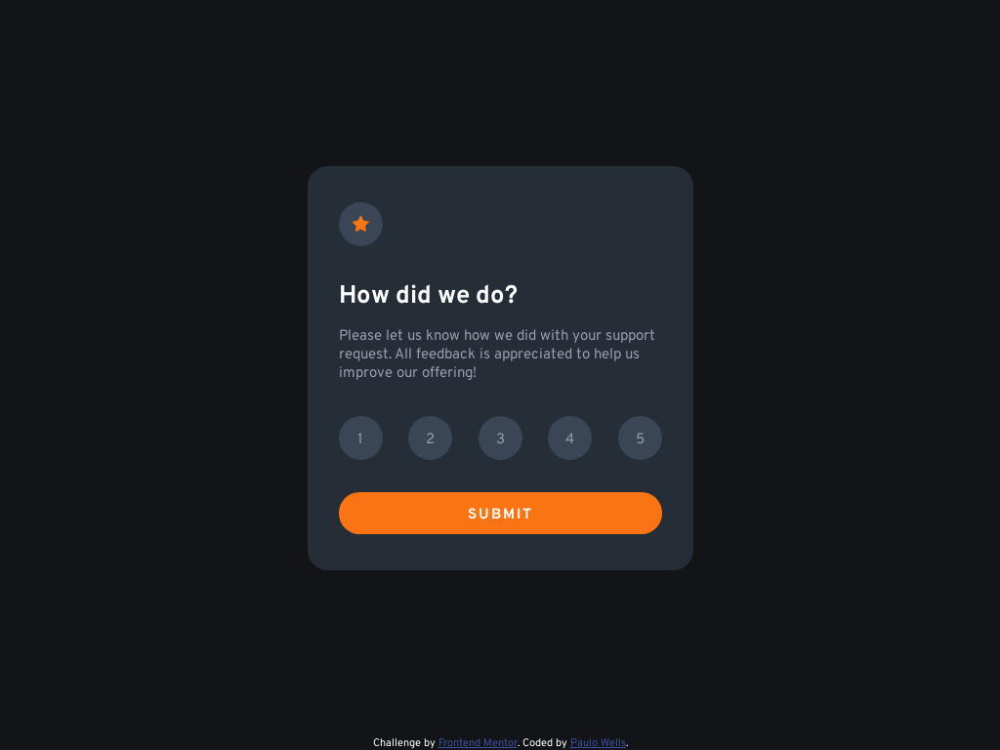
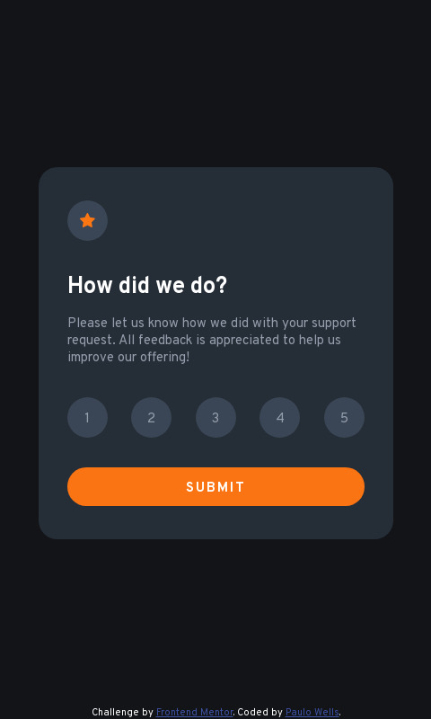

# Frontend Mentor - Interactive rating component solution

This is a solution to the [Interactive rating component challenge on Frontend Mentor](https://www.frontendmentor.io/challenges/interactive-rating-component-koxpeBUmI).

## Table of contents

- [Overview](#overview)
  - [The challenge](#the-challenge)
  - [Screenshots](#screenshots)
  - [Links](#links)
- [My process](#my-process)
  - [Built with](#built-with)
  - [What I learned](#what-i-learned)
- [Author](#author)


## Overview

### The challenge

Users should be able to:

- View the optimal layout for the app depending on their device's screen size
- See hover states for all interactive elements on the page
- Select and submit a number rating
- See the "Thank you" card state after submitting a rating

### Screenshots






### Links

- Solution URL: [Add solution URL here](https://your-solution-url.com)
- Live Site URL: [https://fem-interactive-rating-component-wellspr.vercel.app/](https://fem-interactive-rating-component-wellspr.vercel.app/)

## My process

### Built with

- HTML5 markup
- CSS custom properties
- Flexbox
- Vanilla javascript :)

### What I learned

I used this challenge to revisit the vanilla javascript way of programing applications, with the idea of state in mind. State is the central idea of javascript frameworks such as React, but I wanted to bring a more basic and really starter solution to this challenge.

I kept the single html file containing all the code for both the component views, therefore adopting a single-page-application paradigm.
Then I wrapped each view inside a separate div with the same class *page* and distinct *id*'s, like so:

```html
<div id="rating" class="page">
  <!-- rating state markup -->
</div>

<div id="thank-you" class="page">
  <!-- thank-you state markup -->
</div>
```

Then at the javascript file I add a function to programmatically set the active state, by making use of the css *display* property:

```js
const pages = document.querySelectorAll(".page");

const setActivePage = (pageId) => {
    Object.values(pages).map(page => {
        if (page.id === pageId) {
            page.style.display = "flex";
        }
        else {
            page.style.display = "none";
        }
    });
};

setActivePage("rating");
```

Then, as the user chooses a rating and clicks the "submit" button, the state can be changed with the following code,

```js
submitBtn.addEventListener("click", () => {
    setActivePage("thank-you");
});
```

where `submitBtn` is a DOM reference to the submit button.

**The rating value**

To manage the rating value, I created a global variable to hold one of the possible values ranging from 1 to 5, initially as an empty string:

```js
let ratingValue = "";
```

Then it is possible to get hold of the DOM references of each of the circles representing the rating, and add *onclick* event listeners to each of them, in such a way that a css class of say, "selected" could be added to a given circle as the user clicks it. Also, another iteration is worked out to unselect any previous selection.

Most important, at any click on a rating circle, the value of the variable `ratingValue` is updated to the corresponding value. My code ended up like so:

```js
let ratingValue = "";

const ratingBullets = document.querySelectorAll(".rating-bullet");

Object.values(ratingBullets).map((bullet, index) => {
    const selectRating = () => {
        bullet.classList.add("selected");
        ratingValue = bullet.textContent;
        document.getElementById("rating-value").innerHTML = ratingValue;
        const selectedIndex = index;
        
        Object.values(ratingBullets).map((bullet, index) => {
            if (index !== selectedIndex) {
                bullet.classList.remove("selected");
            }
        });
    };

    bullet.addEventListener("click", selectRating);

    return null;
});
```

<!-- If you want more help with writing markdown, we'd recommend checking out [The Markdown Guide](https://www.markdownguide.org/) to learn more. -->

## Author

- Frontend Mentor - [@wellspr](https://www.frontendmentor.io/profile/wellspr)
